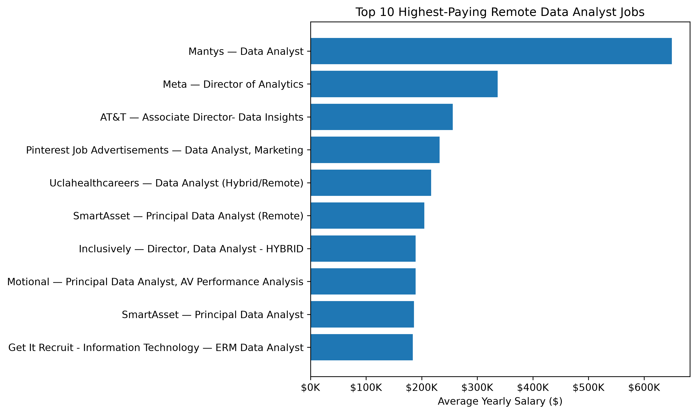
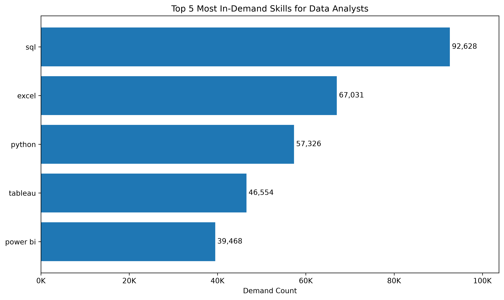
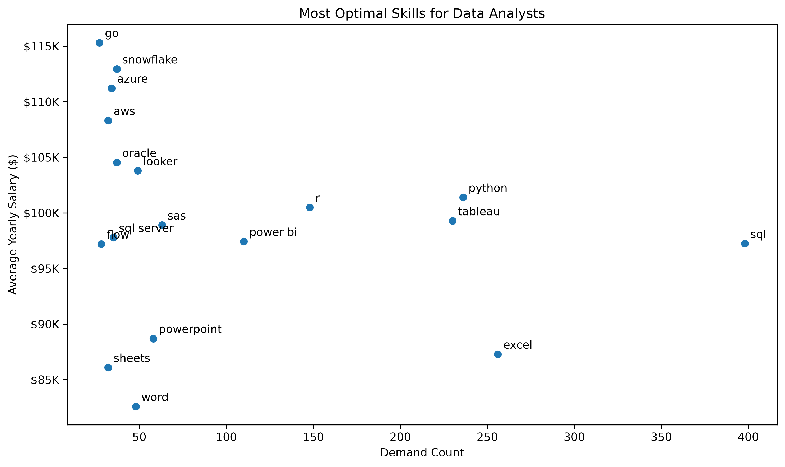

# SQL Job Market Analysis

## Introduction

This project explores the data analyst job market using SQL, with a focus on salaries, skill demand, and the relationship between the two.

The goal was not only to identify the highest-paying opportunities, but also to understand which skills appear most frequently in Data Analyst job postings and which skills offer the strongest combination of **market demand and salary potential**.

The analysis answers five main questions:

1. What are the highest-paying remote Data Analyst jobs?
2. Which skills are required for the highest-paying Data Analyst jobs?
3. What are the most in-demand skills for Data Analysts?
4. Which skills are associated with the highest average salaries?
5. Which skills provide the strongest combination of demand and salary?

## Background

As I continue developing my skills for a career in data analytics, I wanted to use SQL to explore a real-world question that is directly relevant to my own career development: **Which skills are actually valuable in the Data Analyst job market?**

The dataset contains job postings with information about job titles, salaries, companies, locations, and required skills. Using this data, I analyzed the market from several perspectives: starting with high-paying jobs and overall skill demand, and then combining salary and demand to identify skills that may provide the greatest value for aspiring Data Analysts.

Rather than relying only on individual high-salary observations, I also considered the number of job postings associated with each skill. This helps reduce the influence of niche skills that may appear highly paid based on only a very small number of observations.

## Tools I Used

- **SQL:** Used to explore, filter, join, and aggregate the job market data.
- **PostgreSQL:** Used as the database management system for storing and querying the dataset.
- **Python:** Used to further explore the SQL query results and create visualizations.
- **Pandas:** Used to load and work with the exported SQL results in Python.
- **Matplotlib:** Used to visualize salary, skill demand, and the relationship between demand and salary.
- **Jupyter Notebook:** Used as the environment for Python-based analysis and visualization.
- **Visual Studio Code:** Used to write and execute SQL queries and manage the project files.
- **Git & GitHub:** Used for version control and to document and share the project.


## Project Structure

The repository is organized into separate folders for the SQL queries and their outputs:

- `project_sql/` — Contains the five SQL queries used in the analysis.
- `results/` — Contains the CSV outputs generated from the SQL queries.
- `sql_load/` — Contains the SQL scripts used to set up and load the database.
- `notebooks/` — Contains the three Python notebooks used to analyze and visualize selected SQL results.
- `images/` — Contains the Python-generated visualizations used in this README.


## The Analysis

### 1. Top-Paying Remote Data Analyst Jobs

To identify the highest-paying opportunities, I filtered for remote Data Analyst positions with reported yearly salaries and ranked them by average annual salary. Company information was added using the company dimension table.

```sql
SELECT
    jpf.job_id,
    jpf.job_title,
    cd.name AS company_name,
    jpf.job_location,
    jpf.job_country,
    jpf.job_schedule_type,
    jpf.salary_year_avg,
    jpf.job_posted_date
FROM
    job_postings_fact jpf
LEFT JOIN company_dim cd ON jpf.company_id = cd.company_id
WHERE
    jpf.job_title_short = 'Data Analyst' AND
    jpf.job_work_from_home = TRUE AND
    jpf.salary_year_avg IS NOT NULL
ORDER BY
    jpf.salary_year_avg DESC
LIMIT 10;
```

#### Key Insights

The results show substantial salary variation even among the ten highest-paying remote positions. The highest-paying posting, from Mantys, reports an average yearly salary of **$650,000**, while the tenth position is around **$184,000**.

The results also show that the `Data Analyst` category includes a wide range of seniority levels and job titles, including Director and Principal-level positions. This is important when interpreting the salary range, as the highest salaries are not necessarily associated with traditional entry- or mid-level Data Analyst roles.




### 2. Skills Required for Top-Paying Jobs

After identifying the ten highest-paying remote positions, I examined the skills associated with those same jobs.

I first isolated the top-paying jobs in a CTE and then joined the result to the skills tables. `LEFT JOIN` was used intentionally so that the original top-ten job set would be preserved even when a posting had no recorded skill information.

```sql
WITH top_paying_jobs AS (
    SELECT
        jpf.job_id,
        jpf.job_title,
        cd.name AS company_name,
        jpf.job_country,
        jpf.salary_year_avg
    FROM
        job_postings_fact jpf
    LEFT JOIN company_dim cd ON jpf.company_id = cd.company_id
    WHERE
        jpf.job_title_short = 'Data Analyst' AND
        jpf.job_work_from_home = TRUE AND
        jpf.salary_year_avg IS NOT NULL
    ORDER BY
        jpf.salary_year_avg DESC
    LIMIT 10
)

SELECT
    tpj.job_id,
    tpj.job_title,
    tpj.company_name,
    sd.skills,
    tpj.job_country,
    tpj.salary_year_avg
FROM top_paying_jobs tpj
LEFT JOIN skills_job_dim sjd ON tpj.job_id = sjd.job_id
LEFT JOIN skills_dim sd ON sjd.skill_id = sd.skill_id
ORDER BY
    tpj.salary_year_avg DESC;
```

#### Key Insights

The result demonstrates that high-paying Data Analyst positions typically require a combination of skills rather than one isolated technology. It also shows why the structure of the data matters: because one job can require multiple skills, joining jobs to the skills table naturally produces multiple rows for the same job.

This is a legitimate one-to-many relationship rather than duplicate data. Preserving that relationship allows the individual skills associated with each high-paying position to be examined without losing jobs that have missing skill information.


### 3. Most In-Demand Skills for Data Analysts

To understand the broader Data Analyst market, I counted how many distinct job postings were associated with each skill.

Unlike the first two analyses, this query is not restricted to remote jobs. The goal here is to measure overall skill demand across Data Analyst postings in the dataset.

```sql
SELECT 
    sd.skills,
    COUNT(DISTINCT sjd.job_id) AS demand_count
FROM
    job_postings_fact jpf
JOIN skills_job_dim sjd ON jpf.job_id = sjd.job_id
JOIN skills_dim sd ON sjd.skill_id = sd.skill_id
WHERE
    jpf.job_title_short = 'Data Analyst'
GROUP BY
    sd.skills
ORDER BY
    demand_count DESC
LIMIT 5;
```

#### Key Insights

- **SQL** is the most frequently requested skill, appearing in **92,628** Data Analyst job postings.
- **Excel** follows with **67,031** postings, showing that spreadsheet skills remain highly relevant despite the growth of more technical analytics tools.
- **Python** appears in **57,326** postings, making it the most demanded programming language among the top five.
- **Tableau** (**46,554**) and **Power BI** (**39,468**) demonstrate the importance of data visualization and business intelligence skills.

Together, the results suggest that the core Data Analyst skill set combines database querying, spreadsheets, programming, and BI/visualization rather than being dominated by a single type of tool.




### 4. Skills Associated With Higher Salaries

Looking only at the highest average salary for each skill can be misleading. A niche skill may appear extremely well-paid simply because it occurs in one or two unusually high-paying jobs.

To reduce the influence of these very small samples, I included only skills associated with at least **10 distinct Data Analyst job postings with reported salaries**.

```sql
SELECT
    sd.skills,
    ROUND(AVG(jpf.salary_year_avg)) AS avg_salary,
    COUNT(DISTINCT jpf.job_id) AS demand_count
FROM
    job_postings_fact jpf
JOIN skills_job_dim sjd ON jpf.job_id = sjd.job_id
JOIN skills_dim sd ON sjd.skill_id = sd.skill_id
WHERE
    jpf.job_title_short = 'Data Analyst' AND
    jpf.salary_year_avg IS NOT NULL 
GROUP BY
    sd.skills
HAVING
    COUNT(DISTINCT jpf.job_id) >= 10
ORDER BY
    avg_salary DESC
LIMIT 25;
```

#### Methodological Note

The threshold of 10 postings is not a universal statistical rule. It is a practical filtering choice intended to make the salary ranking more informative by reducing the influence of skills supported by only a handful of observations.

Using `COUNT(DISTINCT job_id)` also ensures that the threshold represents distinct job postings rather than potentially duplicated relationships in the skills bridge table.

#### Key Insights

After applying the minimum-observation threshold, the highest-paying skills shift toward technologies related to data engineering, machine learning, cloud infrastructure, and advanced data processing.

Skills such as **Kafka, PyTorch, TensorFlow, Airflow, Spark, Databricks, Snowflake, and GCP** appear among the higher-paying skills. This suggests that Data Analyst roles overlapping with more technical data engineering or machine learning responsibilities may command higher salaries.

At the same time, average salary alone does not tell us whether a skill is widely demanded. That leads to the final analysis.


### 5. Skills With the Best Salary-Demand Balance

The final analysis combines the two dimensions explored separately above: **market demand and salary**.

For this analysis, I focused specifically on remote Data Analyst positions with reported salaries. Skills appearing in 25 or fewer job postings were excluded so that the comparison focuses on technologies with a more established market presence.

```sql
SELECT
    sd.skills,
    ROUND(AVG(jpf.salary_year_avg)) AS avg_salary,
    COUNT(DISTINCT sjd.job_id) AS demand_count
FROM
    job_postings_fact jpf
JOIN skills_job_dim sjd ON jpf.job_id = sjd.job_id
JOIN skills_dim sd ON sjd.skill_id = sd.skill_id
WHERE
    jpf.job_title_short = 'Data Analyst' AND
    jpf.salary_year_avg IS NOT NULL AND
    jpf.job_work_from_home = TRUE
GROUP BY
    sd.skills
HAVING
    COUNT(DISTINCT sjd.job_id) > 25
ORDER BY
    avg_salary DESC,
    demand_count DESC
LIMIT 25;
```

#### Key Insights

The results reveal an important trade-off between **how frequently a skill is requested** and **the salary associated with it**.

- **SQL** has by far the strongest demand among the included skills, although its average salary is lower than several more specialized technologies.
- **Python** combines very high demand with an average salary above $100K, making it one of the strongest general-purpose skills in the analysis.
- **Tableau** and **Power BI** show substantial demand, reinforcing the market value of business intelligence and visualization skills.
- Cloud and data-platform technologies such as **Snowflake, Azure, and AWS** have lower demand than SQL or Python but are associated with higher average salaries.
- Highly paid niche skills should not automatically be interpreted as the best skills to learn; demand provides essential context.

The scatter plot makes this trade-off visible: skills further to the **right** have greater demand, while skills positioned **higher** are associated with higher average salaries. Skills that perform strongly across both dimensions represent particularly attractive areas for skill development.




## What I Learned

This project helped me move beyond writing individual SQL queries and think more carefully about how analytical decisions affect the results.

Some of the key things I practiced and learned were:

- **Joining relational tables:** I worked with job, company, and skill tables using both `INNER JOIN` and `LEFT JOIN`, depending on whether unmatched records needed to be preserved.
- **Handling one-to-many relationships:** Joining jobs to skills showed how a single job posting can expand into multiple rows when several skills are associated with it.
- **Aggregating data:** I used `COUNT()`, `COUNT(DISTINCT ...)`, `AVG()`, `GROUP BY`, and `HAVING` to turn individual job postings into meaningful market-level insights.
- **Using CTEs:** I used a Common Table Expression to first identify the highest-paying jobs and then analyze the skills associated with those positions.
- **Thinking about sample size:** I found that ranking skills only by average salary can produce misleading results when a skill appears in very few job postings. To reduce this effect, I introduced minimum-demand thresholds when analyzing salary and optimal skills.
- **Connecting SQL with Python:** After exporting query results, I used Pandas and Matplotlib to create visualizations for the most important findings.
- **Using Git and GitHub:** I used version control throughout the project to track changes and organize the analysis as a reproducible portfolio project.


## Conclusions

### Key Findings

The analysis revealed several clear patterns in the Data Analyst job market:

- **SQL stands out as the strongest foundational skill.** It was the most frequently requested skill in the dataset, appearing in 92,628 Data Analyst job postings.
- **Excel remains highly relevant**, ranking second in overall demand with 67,031 postings.
- **Python offers a strong combination of demand and salary potential.** It appeared in 57,326 postings overall and remained competitive when salary and demand were considered together.
- **Visualization and BI skills are an important part of the Data Analyst toolkit.** Tableau and Power BI were both among the most frequently requested skills.
- **More specialized technologies can be associated with higher salaries.** Skills related to cloud platforms, data engineering, and machine learning appeared frequently among the higher-paying skills, although many had lower overall demand than SQL, Excel, or Python.
- **Salary alone does not provide enough context to evaluate a skill.** Some niche skills initially appeared extremely well-paid despite being associated with very few job postings. Considering the number of available opportunities alongside salary produced a more useful picture of the market.

### Final Takeaway

There is no single "best" skill for a Data Analyst. The results suggest that the strongest foundation comes from widely demanded tools such as **SQL, Excel, and Python**, supported by visualization tools such as **Tableau or Power BI**.

More specialized cloud and data technologies can provide additional salary potential, but their value becomes more meaningful when considered together with actual market demand.

For me, the main takeaway from this project is that choosing what to learn should not be based only on which skill has the highest salary attached to it. A better approach is to consider **demand, salary, and the number of available opportunities together**.

